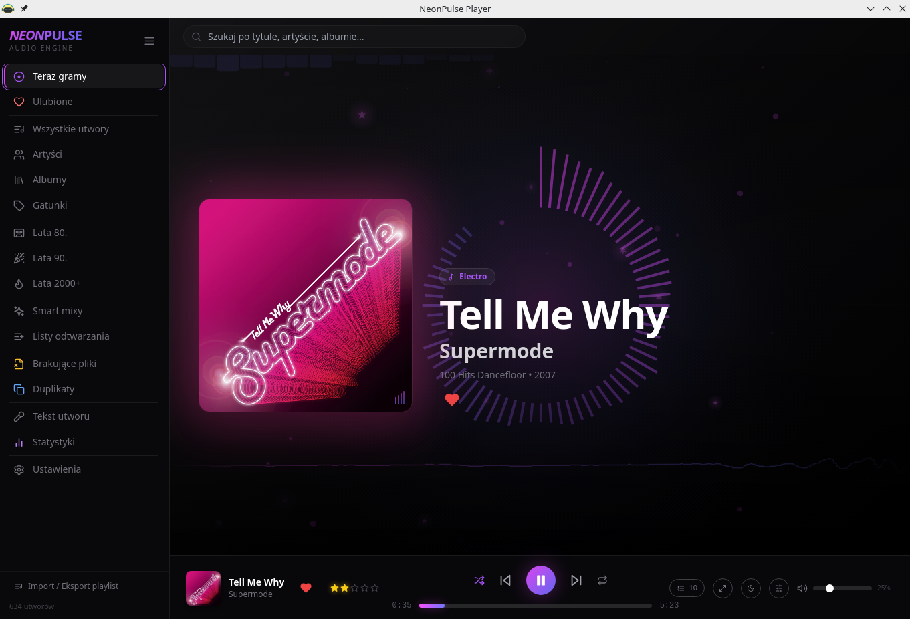
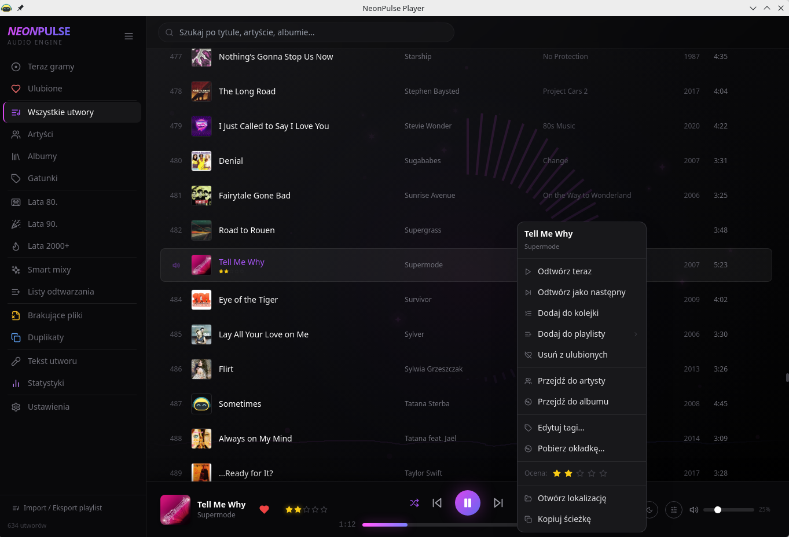
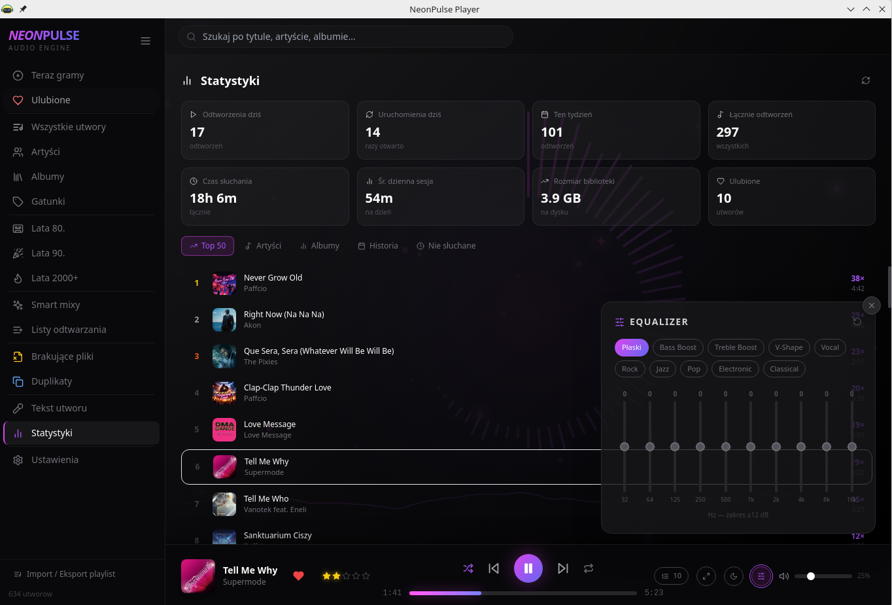
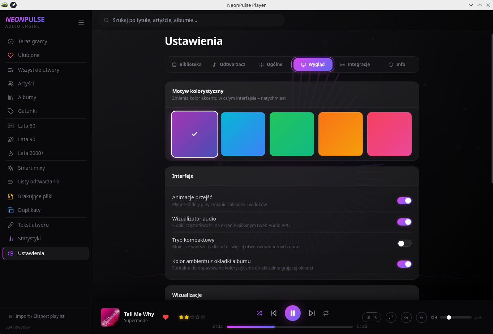

<div align="center">


# NeonPulse Player

**Lokalny odtwarzacz muzyki dla Linuksa, z biblioteką SQLite, MPRIS i nowoczesnym UI.**

[](package.json)
[](#instalacja)
[](https://electronjs.org)
[](https://react.dev)
[](https://sqlite.org)

</div>

---

## Zrzuty Ekranu

<div align="center">







</div>

---

## Najważniejsze Funkcje

| Obszar | Co potrafi |
| --- | --- |
| Odtwarzanie | MP3, FLAC, OGG, WAV, AAC i inne formaty wspierane przez Chromium |
| Kolejka | Kolejka i aktywny utwór są zapisywane między sesjami |
| Przejścia | Gapless playback albo crossfade, z automatycznym wykluczaniem konfliktu |
| Dźwięk | 10-pasmowy equalizer, szybki panel EQ, ReplayGain i fade-in |
| System Linux | MPRIS v2, klawisze multimedialne, panel KDE/GNOME i tray |
| Biblioteka | SQLite, live scan folderów, wyszukiwanie, sortowanie i widoki szczegółowe |
| Metadane | Edycja tagów, zbiorcza edycja, oceny, okładki z MusicBrainz / Cover Art Archive |
| Playlisty | Playlisty lokalne, smart playlisty, import M3U/PLS/XSPF i eksport M3U |
| Teksty | Pliki `.lrc`, teksty embedded i synchronizacja z postępem utworu |
| Last.fm | Scrobbling, now playing i przełącznik integracji w ustawieniach |

---

## Interfejs

- Widoki: `Teraz gramy`, `Wszystkie utwory`, `Ulubione`, artyści, albumy, gatunki, dekady, playlisty, statystyki, tekst utworu, duplikaty i brakujące pliki.
- Dolny pasek odtwarzacza z okładką, tytułem, artystą, kolejką, wyłącznikiem czasowym i opcjonalnymi skrótami.
- Kliknięcie okładki przechodzi do `Teraz gramy`, tytułu do albumu, a artysty do jego albumów.
- Motywy kolorystyczne, ambient z okładki albumu, animacje przejść i tryb kompaktowy list.
- Wizualizacje audio: `Mgławica`, `Słupy`, `Tunel` i `Zorza`, z opcjonalnym delikatnym prześwitem w tle widoków.
- Pełnoekranowy widok odtwarzania z okładką, tekstem i kolejką.

---

## Ustawienia I Automatyzacja

- Automatyczne przywracanie ostatniego utworu, pozycji i kolejki.
- Start zminimalizowany do traya, minimalizacja do traya i kontrolki w menu traya.
- Konfigurowalne przyciski paska odtwarzacza: widok odtwarzania, equalizer i wyłącznik czasowy.
- Wyłącznik czasowy z presetami i własnym limitem minut.
- Aktualizacje sprawdzane z GitHub Releases.
- Przeciąganie folderów do okna aplikacji dodaje je do biblioteki.

---

## Skróty Klawiszowe

| Skrót | Akcja |
| --- | --- |
| `Space` | Play / pauza |
| `←` / `→` | Poprzedni / następny utwór |
| `Shift+←` / `Shift+→` | Cofnij / przewiń o 10 sekund |
| `↑` / `↓` | Głośność w górę / w dół |
| `M` | Wycisz / odcisz |
| `S` | Shuffle |
| `Ctrl+F` | Szukaj |

---

## Instalacja

### Wymagania Deweloperskie

- Linux
- Node.js 18+
- npm 9+

### Uruchomienie Z Kodu

```bash
git clone https://github.com/PaffcioStudio/neonpulse.git
cd neonpulse
npm install
npm start
```

`npm start` uruchamia Vite oraz aplikację Electron. Backend Express działa na porcie `3001`, a Vite na `5173`.

### Build

```bash
npm run build
npm run dist
```

`npm run build` tworzy frontend w katalogu `dist/`.
`npm run dist` buduje paczki `.deb` i `AppImage` w katalogu `release/`.

---

## Struktura Projektu

```text
neonpulse/
├── electron-main.js          # Electron, tray, MPRIS, okno aplikacji
├── server.js                 # Express API, SQLite, skanowanie i integracje
├── src/
│   ├── components/           # Komponenty React
│   ├── components/views/     # Widoki aplikacji
│   ├── hooks/                # Logika odtwarzacza i Last.fm
│   ├── ipc.js                # Bezpieczny most IPC
│   └── utils.js              # Pomocnicze funkcje UI i biblioteki
├── resources/                # Ikony i metadane linuksowe
├── screenshots/              # Zrzuty ekranu do README
└── scripts/                  # Instalacja i hooki paczek
```

---

## Stack

| Technologia | Rola |
| --- | --- |
| Electron 28 | Aplikacja desktopowa |
| React 18 | Interfejs |
| Vite 4 | Bundler |
| Tailwind CSS | Style |
| Express | Lokalne REST API |
| SQLite / better-sqlite3 | Biblioteka, playlisty i statystyki |
| music-metadata | Odczyt tagów audio |
| node-id3 | Zapis tagów MP3 |
| chokidar | Live scan folderów |
| Web Audio API | Equalizer i wizualizacje |
| MPRIS D-Bus | Integracja z systemem Linux |
| Last.fm API | Scrobbling |
| Lucide React | Ikony |

---

## Licencja

MIT © Paffcio 2026
